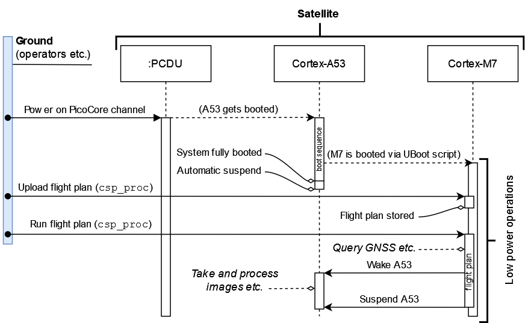

# Application/System manager (Linux system calls over CSP)
An application has been developed to expose the Linux-side of the PicoCoreMX8MP over CSP as `app-sys-manager` ([node 21](https://github.com/discosat/disco-ii-picocore-mx8mp-yocto/blob/abdbd7e010e0df98ba760e54e6f26431f001dc46/custom/layers/meta-disco-scheduler/files/app-sys-manager/main.c#L53-L54) as of writing), providing a remote interface to run system calls on the Linux system. The application is registered as a [systemd service](https://github.com/discosat/disco-ii-picocore-mx8mp-yocto/blob/master/custom/layers/meta-disco-scheduler/files/a53-app-sys-manager.service), so it starts automatically when the system boots up.

The `app-sys-manager` can be used for various tasks such as:
- Suspending linux (A53 cores into WFI) - this also brings this node down, so it must be woken up from the Cortex-M7 via its `wake_a53` parameter
  - set `suspend_a53` to any value to suspend the A53 cores
  - set `suspend_on_boot` to any value greater than or equal to 1 to suspend the A53 cores on boot (This is a persistent setting)
 
- Installing Vimba drivers
  - set `vimba_install` to any value to install Vimba drivers
 
- Start/stop camera control process
  - set `mng_camera_control n` start the camera control application as node number `n` (n=0 kills any running camera control process)
 
- Start/stop image processing (DIPP) process
  - set `mng_dipp n` start the DIPP application as node number `n` (n=0 kills any running DIPP process)
 
- _Switching the Cortex-M7 binary between the main (`/home/root/disco_scheduler.bin`) and stage files (`/home/root/_stage_disco_scheduler.bin`)_
  - _set `switch_m7_bin` to any value to switch the Cortex-M7 binaries_ - NOTE: Switching the Cortex-M7 binary is disabled for now, as it only makes sense if file upload to the Linux filesystem gets implemented.
 
- Rebooting PicoCoreMX8MP
  - run `reboot` command (affects Cortex-M7 application as well). This uses the default CSP reboot hook.

*Conceptual overview of the primary operation sequence*

## Payload Nodes in the CSP network
When the system is fully up and running, the PicoCoreMX8MP will contain the following nodes in the CSP network:
- [Node 4](https://github.com/discosat/disco-ii-cortex-m7-scheduler/blob/821999c8f77075fcfcbb1f671cf0a9abff5edba9/src/can_iface.c#L41-L46): Cortex-M7 (low-power operations and `csp_proc` server)
- [Node 21](https://github.com/discosat/disco-ii-picocore-mx8mp-yocto/blob/abdbd7e010e0df98ba760e54e6f26431f001dc46/custom/layers/meta-disco-scheduler/files/app-sys-manager/main.c#L53-L54): Cortex-A53 (`app-sys-manager`)
- [Node x](https://github.com/discosat/disco-ii-picocore-mx8mp-yocto/blob/abdbd7e010e0df98ba760e54e6f26431f001dc46/custom/layers/meta-disco-scheduler/files/app-sys-manager/main.c#L170): Camera control application
- [Node y](https://github.com/discosat/disco-ii-picocore-mx8mp-yocto/blob/abdbd7e010e0df98ba760e54e6f26431f001dc46/custom/layers/meta-disco-scheduler/files/app-sys-manager/main.c#L199): Image processing pipeline (DIPP) application
