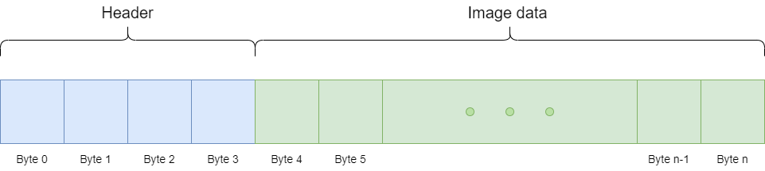

# Camera Controller
[The Disco-2 camera controller](https://github.com/ivaroli/DiscoCameraController) is a controller that controls the visible and IR light cameras onboard the Disco-2 payload. It's purpose is to fetch raw image data from the camera sensors and pass them to the image processing pipeline (DIPP). It interfaces with the processing pipeline over System V message queue and shared memory, and it exposes a parameter with libparam over CSP that allows sending of image capture instructions.

## Overview

### Image data
When the camera captures an image from the visible light cameras, the controller captures the raw **BayerRG** data from the camera sensor. The controller then packages the data into a `unsigned char *data` array. It also prepends a 4 byte integer in front of the image data, indicating the size of the image. A diagram representing the data generated from a single image is below:



The camera can also capture a burst of images. This burst of images will be packaged together into a single batch that will be sent to the image processing pipeline.


The image processing pipeline and the camera communicate using [System V Shared Memory](https://docs.oracle.com/cd/E19683-01/816-5042/svipc-41256/index.html) and a [System V Message Queue](https://docs.oracle.com/cd/E19683-01/816-5042/svipc-23310/index.html). When the camera captures a burst of images, it generates a shared memory segment and inserts the image data into it. Afterwards, the camera controller sends a System V message queue message to the image processing pipeline to signal that the images are ready for processing. Upon receiving this message, the processing pipeline retrieves the images from the shared memory segment before deallocating it. The message queue message is structured as a defined struct, as shown below.

```c
typedef struct ImageBatch {
    long mtype;          /* message type to read from the message queue */
    int height;          /* height of images */
    int width;           /* width of images */
    int channels;        /* channels of images */
    int num_images;      /* amount of images */
    int batch_size;      /* size of the entire image batch of data */
    int shm_key;         /* key to shared memory segment of image data */
    int pipeline_id;     /* id of pipeline to utilize for processing */
    unsigned char *data; /* address to image data (in shared memory) */
} ImageBatch;
```

Below is a sequence diagram illustrating the entire process of capturing images and delivering them to the processing pipeline:


### Visible light sensor data
The camera controller captures raw data from the visible light image sensors in a BayerRG format with a 12-bit pixel depth. In this format, every two bytes in the image data represent a single R, G, or B pixel. This approach is taken to grant the image processing pipeline greater control over image processing. Below is a visual representation of the BayerRG pixel format.


### IR light sensor data
**Undecided**

## Capturing images
The camera controller exposes a CSP parameter through [libparam](https://github.com/spaceinventor/libparam), called `capture_param`. This parameter is a semi-colon seperated string of values describing the image capture. An example of a CSH command setting this parameter is below:

```
set capture_param "CAMERA=1800 U-2040c;NUM\_IMAGES=10;EXPOSURE=55000;ISO=0;"
```

The possible values that can be set are the following.

|        Name |        Type |        Example |        Description                                            |        Required |        Default                         |
|-------------|-------------|----------------|---------------------------------------------------------------|-----------------|----------------------------------------|
| CAMERA      | string      | 1800 U-2040c   | The model of the camera to capture with                       | True            | N/A                                    |
| EXPOSURE    | int         | 55000          | Exposure in microseconds                                      | False           | If not set, then exposure is estimated |
| ISO         | double      | 1.0            | ISO or gain                                                   | False           | 1                                      |
| NUM_IMAGES  | int         | 10             | Number of images to capture                                   | False           | 1                                      |
| INTERVAL    | int         | 0              | Delay between images in microseconds (not including exposure) | False           | 0                                      |

## Building
The Camera controller is built with the Meson build system. A build script is included in the [github repository](https://github.com/ivaroli/DiscoCameraController). Simply call `./configure.sh` and the controller will be built.

## Error log
The camera controller provides an integer parameter via the CSP parameter named error_log, denoting the latest cause of failure encountered during image capture. Refer to the table below for the list of potential error codes along with their respective explanations.

| Error Code | Description                                               |
|------------|-----------------------------------------------------------|
| 0          | Success                                                   |
| 100        | General error in parsing of capture instructions          |
| 101        | Invalid camera type or camera type implementation missing |
| 102        | CAMERA_ID is missing from capture instructions            |
| 103        | NUM_IMAGES to capture is 0                                |
| 200        | General error during image capture                        |
| 201        | No cameras connected or found                             |
| 202        | Camera with id CAMERA_ID not found                        |
| 300        | General error in message queue                            |
| 301        | Unable to create shared memory space                      |
| 302        | Unable to insert data into memory space                   |