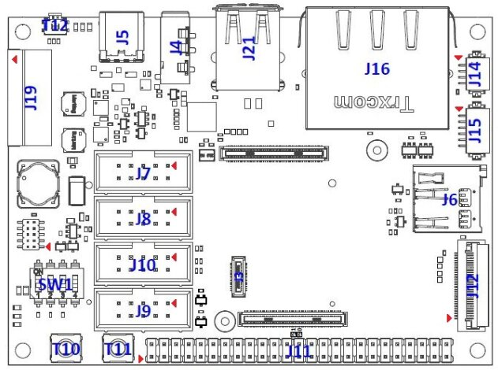

# Getting started
The camera control software, image processing pipeline and scheduler run on a [PicoCore™MX8MP](https://fs-net.de/en/embedded-modules/computer-on-module-picocore/picocoremx8mp-nxp-imx8m-plus-cpu/) computer on module (CoM). The source code and build setup as well as compiled binaries _(WIP but will be attached as a GitHub release)_ for the system image etc. are available on [https://github.com/discosat/disco-ii-picocore-mx8mp-yocto](https://github.com/discosat/disco-ii-picocore-mx8mp-yocto).

## Serial connection to the CoM
To access the bootloader and/or Linux command line, you must establish a serial connection with a baud rate of 115200 to the board over UART_A. This can be done by connecting a USB to Serial UART adapter to your laptop (such as a FT232RL breakout board) and attaching the TX, RX and GND pins to the following pins on the J9 connector of the PicoCoreBBDSI baseboard:
| J9 pin | USB <-> Serial UART |
|:------:|:-------------------:|
|   3    |         TX          |
|   5    |         RX          |
|   9    |        GND          |


*Connector layout of the baseboard. Pin 1 is marked with a small red arrow. Source: [F&S Embedded Baseboard Hardware Documentation](https://fs-net.de/filelicence/get?fileid=11717&locale=en_US)*

Or alternatively connecting TX, RX and GND to the following pins on the (...) connector of the custom DISCO II PCB: _(TODO once PCB is finalized...)_

You can then open a serial connection from your computer to the CoM to access U-Boot/Linux. E.g. if you're running Linux and the USB to Serial adapter is exposed on device file `/dev/ttyUSB0`, you can run `screen /dev/ttyUSB0 115200` to open the connection - and there are many other alternatives to `screen` as well if you prefer to use a different utility. You may need to run something like `sudo chmod 666 /dev/ttyUSB0` first to avoid permission errors.

The system auto-boots into Linux, but if you've ended up in U-Boot, you can run `boot` to boot up the Linux kernel, after which you can log into the `root` user (with no password).

### UART device mapping
| Function                    | Device file     | UART name | Device tree name |
|-----------------------------|-----------------|-----------|------------------|
| Cortex-M7 debug             | `/dev/ttymxc0`  | UART_C    | `uart1`          |
| U-Boot & Linux command line | `/dev/ttymxc1`  | UART_A    | `uart2`          |
| -                           | `/dev/ttymxc2`  | UART_D    | `uart3`          |
| RS485 / CSP KISS interface  | `/dev/ttymxc3`  | UART_B    | `uart4`          |

## Flash the system image onto the payload CoM
Download or follow the instructions in the [discosat/disco-ii-picocore-mx8mp-yocto](https://github.com/discosat/disco-ii-picocore-mx8mp-yocto) repository to build the system image and related files. The resulting files are packaged in a way that are easily flashed onto the CoM by cleverly utilizing the default U-Boot setup on the CoM. Simply move these files to the root directory of a portable storage medium like a USB flash drive or an SD card and plug it into the CoM. After this, power on the CoM and you should eventually see something similar to the following being transmitted on UART_A:
```
Loading /update.scr ... done!
Loaded!
switch to partitions #0, OK
mmc2(part 0) is current device
Loading /emmc-fsimx8mp.sysimg ... done!
14680064 bytes read in 515 ms (27.2 MiB/s)

MMC write: dev # 2, block # 0, count 28672 ... 28672 blocks written: OK
Loading /emmc-fsimx8mp.sysimg ... done!
14680064 bytes read in 518 ms (27 MiB/s)

(...)

Saving Environment to MMC... Writing to MMC(2)... OK
Installation complete
---- update COMPLETE! ----
```
After this, everything is good to go 🚀 You can then run the `boot` command in U-Boot, which boots up the auxiliary Cortex-M7 core and starts the linux kernel.
