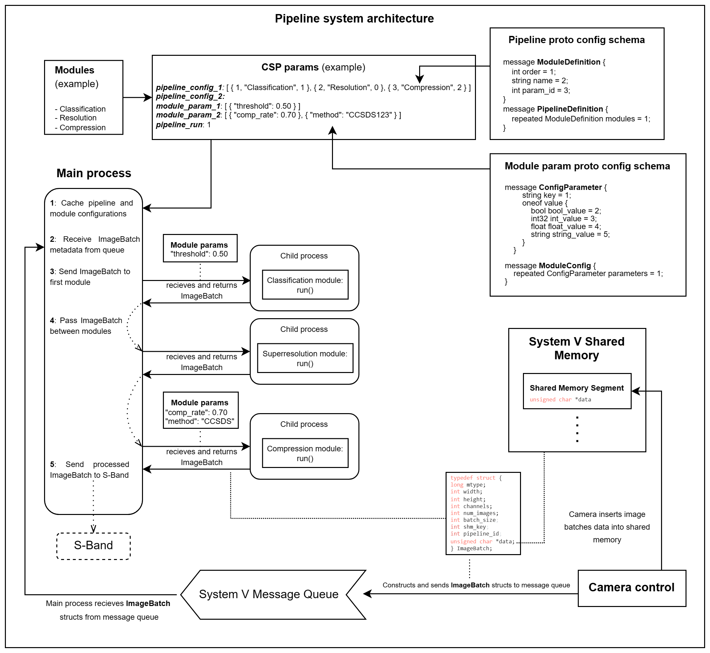

# Image Processing Pipeline
The DISCO-2 Image Processing Pipeline (DIPP) is build as a configurable and extendable image processing pipeline that facilitates remote reconfiguration and reordering of individual modules in the pipeline to provide a flexible solution for diverse imaging needs. Each module is seen as fully self-contained image processing environment which has all its dependencies statically compiled inside.

## Overview
The purpose of the image processing pipeline is to process images from the camera, before they are downlinked to the ground station. The main objective is to filter away bad data to optimize the utilization of the limited downlink bandwidth. The image filtering takes place within different image processing modules in the pipeline.

The image processing pipeline and the camera communicate though the use of [System V Shared Memory](https://docs.oracle.com/cd/E19683-01/816-5042/svipc-41256/index.html) and a [System V Message Queue](https://docs.oracle.com/cd/E19683-01/816-5042/svipc-23310/index.html). The camera will take images in bursts, and batch the data from the raw images together such that each image from the burst will be stored contiguously in a `unsigned char *data` array, which will be located inside a shared memory segment which has been created exclusively for the given image batch. In-between the contiguous image data, a 32-bit integer will be stored which indicates the size of the following image in the data. The image data sizes will be utilized for iterating through the images in the batch, as the image size indicates how many bytes to skip ahead, in order to reach the next image in the batch. An example of some batched image data can be seen below:
```c
// Example buffer containing image data
unsigned char buffer[] = {
    0, 0, 0, 5, 'i', 'm', 'a', 'g', 'e',     // 4 bits allocated for the size of the first image, followed by image data
    0, 0, 0, 3, 'f', 'o', 'o',               // 4 bits allocated for the size the second image, followed by image data
    0, 0, 0, 6, 'b', 'a', 'r', 'b', 'a', 'z' // 4 bits allocated for the size the third image, followed by image data
};
```

The camera will construct some metadata about the saved image batch data, which will be sent to the pipeline through a System V Message Queue, utilizing a static predetermined key for the queue. The metadata will be stored in the following struct:
```c
typedef struct ImageBatch {
    long mtype;          /* message type to read from the message queue */
    int height;          /* height of images */
    int width;           /* width of images */
    int channels;        /* channels of images */
    int num_images;      /* amount of images */
    int batch_size;      /* size of the entire image batch of data */
    int shm_key;         /* key to shared memory segment of image data */
    int pipeline_id;     /* id of pipeline to utilize for processing */
    unsigned char *data; /* address to image data (in shared memory) */
} ImageBatch;
```

The `ImageBatch` struct contains information about the images in the batch, such as their width, height, amount of channels and amount of images. The `ImageBatch` struct will also contain a pointer to the shared memory segment, where the raw image data is stored.

While processing the raw image data, the pipeline modules will modify the image data from shared memory and either reuse the same shared memory segment, or create a new shared memory segment if the new image data wont fit into the old segment. When a module finishes, it updates the data in the `ImageBatch` struct, and updates the pointer to the shared memory segment, if it has changed. Hereafter the `ImageBatch` struct is passed onto the next module in the pipeline.

In order to ensure isolation and fault-tolerance, each module will be executed in a child-process forked by the main pipeline process. The main process will supervise the execution of the child-processes and fail gracefully if a module encounters a failure (e.g. encounters a runtime exception). The image batch structs are sent back and forth in-between modules through the use of `pipes` which enable secure and isolated data transfer between different memory spaces. This method not only keeps the module outputs separate, but also provides a checkpoint for the supervisor (main process) to verify the successful completion of the child’s task.

The pipeline and the modules are configured through CSP where configurations are sent to the pipeline using generic [Protobuf](https://protobuf.dev/) schemas which hold the required information. The configurations are made, and sent, using our CSH extension service described in [the following section](#configuring-the-pipeline).

An overview of how the module execution and configuration takes place, and how the pipeline interacts with the camera, can be seen in the following diagram:


*Software architecture diagram of the DISCO-2 image processing pipeline. This diagram illustrates a scenario with example image processing modules and configurations. The diagram showcases how the pipeline interacts with the camera through shared memory and a System V Message Queue.*

## Configuring the Pipeline
Setting up DIPP involves defining the sequence and parameters of processing modules. Configuration can be performed remotely to tailor the pipeline to specific project requirements without direct access to the deployment environment. Two primary functions (`ippc pipeline [options] <pipeline-idx> <config-file>` and `ippc module [options] <module-idx> <config-file>`) are introduced as CSH extensions that enables the reconfiguration of the pipeline and individual modules. The source code and setup for the pipeline CSH extension are available on [github.com/Lindharden/csp_ippc](https://github.com/Lindharden/csp_ippc). The two commands are described in more detail in [Command 1](#command-1-ippc-pipeline) and [Command 2](#command-2-ippc-module)

### Command 1: `ippc pipeline`

This command updates what modules are to be active in the specified pipeline.
DIPP supports the definition of multiple different pipeline configurations, which means a pipeline ID along with an YAML config file (relative path) can be specified.
The configuration defined in the YAML file will hereafter be defined as the configuration of the specific pipeline indicated by the given ID.

Usage:

```
ippc pipeline [options] <pipeline-idx> <config-file>
```

Options:

- `-n, --node [NUM]`: node (default = \<env\>).
- `-t, --timeout [NUM]`: timeout (default = \<env\>).
- `-v, --paramver`: parameter system version (default = 2).
- `-a, --no_ack_push`: Disable ack with param push queue (default = true).

Example:
The below example updates the pipeline configuration for pipeline 1 on node 162 using the specified YAML file.

```
ippc pipeline -n 162 1 "pipeline_config.yaml"
```

Example of a valid pipeline configuration file:

```yaml
- order: 1
  param_id: 1
  name: classification
- order: 2
  param_id: 5
  name: superresolution
- order: 3
  param_id: 2
  name: compression
```
Note: A module included in multiple pipelines can be linked to different param_ids.

### Command 2: `ippc module`

This command updates the parameters for a specific pipeline module.
Specify ID of module and YAML config file (relative path).

Usage:

```
ippc module [options] <module-idx> <config-file>
```

Options:

- `-n, --node [NUM]`: node (default = \<env\>).
- `-t, --timeout [NUM]`: timeout (default = \<env\>).
- `-v, --paramver`: parameter system version (default = 2).
- `-a, --no_ack_push`: Disable ack with param push queue (default = true).

Example:
The below example updates the parameters for module 2 on node 162 using the specified YAML file.

```
ippc module -n 162 2 "module_config.yaml"
```

Example of a valid module configuration file (see also the valid types):

```yaml
# Use following keys for type  #
#   bool    = 2                #
#   integer = 3                #
#   float   = 4                #
#   string  = 5                #

- key: param_name_1
  type: 2
  value: true

- key: param_name_2
  type: 3
  value: 256

- key: param_name_3
  type: 4
  value: 3.1415

- key: param_name_4
  type: 5
  value: DISCO
```

## Serialization of configurations
When configurations are sent through CSP using the ippc extension, the data is serialized using Protobuf. Protobuf serializes to a compact format and allows packing and unpacking directly to and from static structs making it a robust tool. DIPP uses two Protobuf schemas, the first one is for defining modules in a pipeline, the order and linked parameters. See the schema below:
```proto
message ModuleDefinition {
    int32 order = 1;
    string name = 2;
    int32 param_id = 3;
}

message PipelineDefinition {
    repeated ModuleDefinition modules = 1;
}
```

The second Protobuf schema is for declaring module parameters, which are key-value pairs. See the schema below:
```proto
message ConfigParameter {
        string key = 1;
        oneof value {
            bool bool_value = 2;
            int32 int_value = 3;
            float float_value = 4;
            string string_value = 5;
        }
    }

message ModuleConfig {
    repeated ConfigParameter parameters = 1;
}
```

## Building the Pipeline Binary
The application builds using meson/ninja which generates a `builddir` folder containing the executable.

## Running the Application
Run the `dipp` binary in the `builddir` directory using `./builddir/dipp [OPTIONS]`. The `dipp` binary supports the following arguments:

| **Flag** | **Default value** | **Description**                                                             |
|----------|-------------------|-----------------------------------------------------------------------------|
| `-i`     | `ZMQ`             |  The connection interface to utilize for the pipeline. Possible values are: <br> - `ZMQ`: Run the pipeline with ZMQ (requires running ZMQ proxy). <br> - `KISS`: Run the pipeline with a defined KISS device. <br> - `CAN`: Run the pipeline with a defined CAN device. |
| `-p`     | `localhost`       | Port or device to use for the specified connection interface. Examples are: <br> - `/dev/ttyS1` (KISS) <br> - `vcan0` (CAN) |
| `-a`     | `162`             | CSP node address for the DIPP application.                                  |

The pipeline will act as a CSP/Param application.

## Initiating Pipeline Processing

To initiate the pipeline, utilize the `pipeline_run` parameter on the CSP node through CSH. The `pipeline_run` parameter can be set to one of the following values, which determines the pipeline processing behavior.

| **_pipeline_run_ value** | **Batch processing procedure** | **Description**                                                                                         |
|--------------------------|--------------------------------|---------------------------------------------------------------------------------------------------------|
| 1                        | _PROCESS_ONE_                  | Process a single image batch.                                                                           |
| 2                        | _PROCESS_ALL_                  | Process all image batches in message queue.                                                             |
| 3                        | _PROCESS_WAIT_ONE_             | Wait for image batch to arrive in message queue. Then process one image batch.                          |
| 4                        | _PROCESS_WAIT_ALL_             | Wait for image batches to arrive in message queue. Then continuously process all arriving image batches.|

## Error Signaling
DIPP includes an integer parameter indicating the most recent cause of failure. The most resent error code can be accessed through the CSP parameter named `log_status`. The possible error codes, and their meaning, can be seen in the table below.

| Error Code | Description                                            |
|------------|--------------------------------------------------------|
| 100        | Memory Error: Malloc                                   |
| 101        | Memory Error: Realloc                                  |
| 102        | Memory Error: Free                                     |
| 200        | Message Queue Error: Not Found                         |
| 201        | Message Queue Error: Empty                             |
| 300        | Shared Memory Error: Not Found                         |
| 301        | Shared Memory Error: Detach                            |
| 302        | Shared Memory Error: Remove                            |
| 303        | Shared Memory Error: Attach                            |
| 400        | Pipe Error: Read                                       |
| 401        | Pipe Error: Empty                                      |
| 500        | Internal Error: PID Not Found                          |
| 501        | Internal Error: Shared Object Not Found                |
| 502        | Internal Error: Run Not Found                          |
| 503        | Internal Error: Boolean Parameter Not Found            |
| 504        | Internal Error: Integer Parameter Not Found            |
| 505        | Internal Error: Float Parameter Not Found              |
| 506        | Internal Error: String Parameter Not Found             |
| 600        | Module Exit Error: Crash                               |
| 601        | Module Exit Error: Normal                              |
| 700-799    | Module Exit Error: Custom error code defined by module |

All error codes are suffixed with ID of the pipeline (1 digit ranging from 1-9) and index of the module (2 digits ranging from 1-99) if applicable. Error codes suffixed with 0's indicate failure happening outside of a module.

### Error Code Examples
- _**708104**_: Module with index 4 in pipeline 1 failed with code 8.
- _**600212**_: Module with index 12 in pipeline 2 crashed.
- _**300205**_: Could not get Shared Memory in module 5 in pipeline 2.
- _**501000**_: Could not find SO file with name 'module' during preload.
